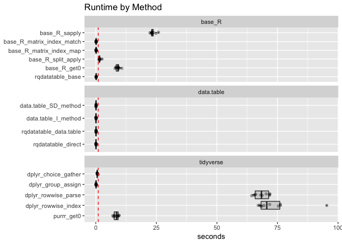
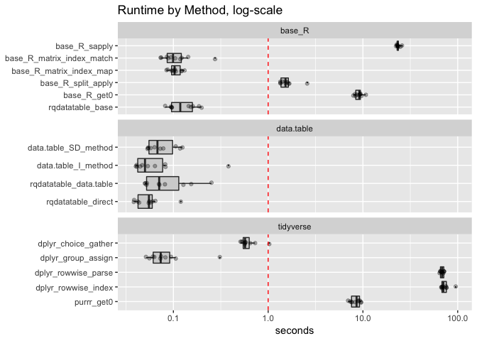

timings
================

``` r
library("microbenchmark")
library("dplyr")
```

    ## Warning: package 'dplyr' was built under R version 3.5.1

    ## 
    ## Attaching package: 'dplyr'

    ## The following objects are masked from 'package:stats':
    ## 
    ##     filter, lag

    ## The following objects are masked from 'package:base':
    ## 
    ##     intersect, setdiff, setequal, union

``` r
library("tidyr")
library("purrr")
library("wrapr")
```

    ## 
    ## Attaching package: 'wrapr'

    ## The following object is masked from 'package:dplyr':
    ## 
    ##     coalesce

``` r
library("data.table")
```

    ## 
    ## Attaching package: 'data.table'

    ## The following object is masked from 'package:wrapr':
    ## 
    ##     :=

    ## The following object is masked from 'package:purrr':
    ## 
    ##     transpose

    ## The following objects are masked from 'package:dplyr':
    ## 
    ##     between, first, last

``` r
library("rqdatatable")
```

    ## Loading required package: rquery

``` r
library("ggplot2")
library("WVPlots")
```

``` r
mk_data <- function(n) {
  data.frame(x = seq_len(n) + 0.0,
             y = seq_len(n) + n + 0.0,
             choice = rep(c("x", "y"), ceiling(n/2))[1:n],
             stringsAsFactors = FALSE)
}

df <- mk_data(1000000)
```

``` r
base_R_sapply <- function(df) {
  # https://community.rstudio.com/t/extracting-value-from-a-data-frame-where-column-name-to-extract-from-is-dynamically-determined-by-values-in-another-column/14585
  df$derived <- sapply( 
    seq_len(nrow(df)), 
    function(i) { 
      df[i, df$choice[[i]], drop = TRUE ]
    })
  df
}

base_R_matrix_index <- function(df) {
  # https://community.rstudio.com/t/extracting-value-from-a-data-frame-where-column-name-to-extract-from-is-dynamically-determined-by-values-in-another-column/14585
  dtmp <- df[, 
             intersect(df$choice, colnames(df)), 
             drop = FALSE]
  df$derived <- dtmp[
    cbind(seq_len(nrow(df)),
          match(df$choice, colnames(dtmp)))]
  df
}

base_R_split_apply <- function(df) {
  df$id = seq_len(nrow(df))
  dfl = split(df, df$choice)
  dfl = lapply(dfl,
               function(dfli) {
                 pick = dfli$choice[[1]]
                 dfli$derived = dfli[[pick]]
                 dfli
               })
  df = do.call(rbind, dfl)
  df = df[order(df$id), , drop=FALSE]
  df$id <- NULL
  df
}

base_R_get0 <- function(df) {
  # http://www.win-vector.com/blog/2018/09/using-a-column-as-a-column-index/#comment-67008
  df$derived <-
    do.call(mapply,c(df,FUN = function(...)
      with(list(...),
           get0(choice,ifnotfound = NA, inherits = FALSE))))
}

purrr_get0 <- function(df) {
  # http://www.win-vector.com/blog/2018/09/using-a-column-as-a-column-index/#comment-67007
  df$derived <-
    pmap_dbl(df, ~with(list(...), get0(choice, ifnotfound = NA,inherits = FALSE)))
  df
}

data.table_SD_method <- function(df) {
  # https://community.rstudio.com/t/extracting-value-from-a-data-frame-where-column-name-to-extract-from-is-dynamically-determined-by-values-in-another-column/14585
  dt <- as.data.table(df)
  dt[, derived := .SD[[choice]], by = choice][]
}

data.table_I_method <- function(df) {
  # https://community.rstudio.com/t/extracting-value-from-a-data-frame-where-column-name-to-extract-from-is-dynamically-determined-by-values-in-another-column/14585
  dt <- as.data.table(df)
  dt[, derived := dt[[choice]][.I], by=choice][]
}


dplyr_choice_gather <- function(df) {
  # https://community.rstudio.com/t/extracting-value-from-a-data-frame-where-column-name-to-extract-from-is-dynamically-determined-by-values-in-another-column/14585
  df <- df %>%
    mutate(id = seq_len(nrow(.)))
  df %>%
    gather("column", "derived", -id, -choice) %>%
    filter(column == choice) %>%
    select(-choice, -column) %>%
    right_join(df, by = "id") %>%
    select(-id)
}

dplyr_group_assign <- function(df) {
  # http://www.win-vector.com/blog/2018/09/using-a-column-as-a-column-index/
  df %>% 
    group_by(choice) %>%
    mutate(derived = .data[[ choice[[1]] ]]) %>%
    ungroup() 
}

dplyr_rowwise_parse <- function(df) {
  # http://www.win-vector.com/blog/2018/09/using-a-column-as-a-column-index/#comment-67006
  df %>%
    rowwise() %>% 
    mutate(derived = eval(parse(text = choice))) %>%
    ungroup()
}


dplyr_rowwise_index <- function(df) {
  df %>%
    rowwise() %>% 
    mutate(derived = .data[[choice]]) %>%
    ungroup()
}

rqdatatable_direct <- make_dt_lookup_by_column("choice", "derived")
```

``` r
timings <- microbenchmark(
  base_R_sapply = base_R_sapply(df),
  base_R_matrix_index = base_R_matrix_index(df),
  base_R_split_apply = base_R_split_apply(df),
  base_R_get0 = base_R_get0(df),
  data.table_SD_method = data.table_SD_method(df),
  data.table_I_method = data.table_I_method(df),
  dplyr_choice_gather = dplyr_choice_gather(df),
  dplyr_group_assign = dplyr_group_assign(df),
  dplyr_rowwise_parse = dplyr_rowwise_parse(df),
  dplyr_rowwise_index = dplyr_rowwise_index(df),
  purrr_get0 = purrr_get0(df),
  rqdatatable_full = lookup_by_column(df, "choice", "derived"),
  rqdatatable_direct = rqdatatable_direct(df),
  unit = 's',
  times = 10L
)
saveRDS(timings, file = "timings.RDS")
```

``` r
tdf <- as.data.frame(timings)


tdf$seconds <- tdf$time/1e+9
tdf$method <- factor(as.character(tdf$expr),
                     rev(levels(tdf$expr)))

method_family <- qc(
  base_R_sapply = base_R,
  base_R_matrix_index = base_R,
  base_R_split_apply = base_R,
  base_R_get0 = base_R,
  purrr_get0 = tidyverse,
  data.table_SD_method = data.table,
  data.table_I_method = data.table,
  dplyr_choice_gather = tidyverse,
  dplyr_group_assign = tidyverse,
  dplyr_rowwise_parse = tidyverse,
  dplyr_rowwise_index = tidyverse,
  rqdatatable_full = data.table,
  rqdatatable_direct = data.table
)

tdf$method_family <- method_family[as.character(tdf$method)]

tdf %.>%
  project_nse(., 
              groupby = "method",
              mean_seconds = mean(seconds)) %.>%
  orderby(., "mean_seconds")
```

    ##                   method mean_seconds
    ##  1:   rqdatatable_direct   0.05405786
    ##  2:   dplyr_group_assign   0.06315023
    ##  3: data.table_SD_method   0.10567279
    ##  4:  data.table_I_method   0.10979534
    ##  5:  base_R_matrix_index   0.13583194
    ##  6:     rqdatatable_full   0.17208519
    ##  7:  dplyr_choice_gather   0.67627983
    ##  8:   base_R_split_apply   1.54704491
    ##  9:          base_R_get0   9.03824150
    ## 10:           purrr_get0   9.48282369
    ## 11:        base_R_sapply  24.00578467
    ## 12:  dplyr_rowwise_index  71.82359545
    ## 13:  dplyr_rowwise_parse  72.22674163

``` r
WVPlots::ScatterBoxPlotH(tdf, "seconds","method",  
                         title="Runtime by Method") +
  facet_wrap(~method_family, ncol = 1, drop = TRUE, scales = "free_y") +
  geom_hline(yintercept = 1, color = "red", linetype = 2) + 
  xlab(NULL)
```



``` r
WVPlots::ScatterBoxPlotH(tdf, "seconds","method",  
                         title="Runtime by Method, log-scale") + 
  scale_y_log10() +
  facet_wrap(~method_family, ncol = 1, drop = TRUE, scales = "free_y") +
  geom_hline(yintercept = 1, color = "red", linetype = 2) + 
  xlab(NULL)
```


