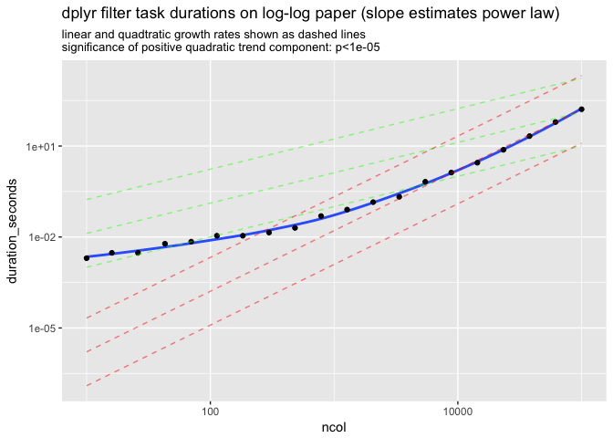

filter
================
2/4/2018

Set up the problem (from [here](https://github.com/tidyverse/dplyr/issues/3335)).

``` r
library("feather")
df <- as.data.frame(matrix(nrow = 1, 
                           ncol = 100000,
                           data = 0.0))
system.time(write_feather(df, "df.feather"))
```

    ##    user  system elapsed 
    ##   0.306   0.261   0.604

[R](https://www.r-project.org) timing.

``` r
system.time(fetched_sample <- df[df$V1>1, , drop=FALSE])
```

    ##    user  system elapsed 
    ##   0.678   0.011   0.697

[dplyr](https://CRAN.R-project.org/package=dplyr) timing.

``` r
library("dplyr")

tb <- as_tibble(df)

system.time(fetched_sample <- filter(tb, V1>1))
```

    ##    user  system elapsed 
    ## 130.345   8.316 139.760

[data.table](https://CRAN.R-project.org/package=data.table) timing.

``` r
library("data.table")

dt <- data.table(df)

system.time(dt[V1>1, ])
```

    ##    user  system elapsed 
    ##   1.658   0.005   1.667

[Python](https://www.python.org) [Pandas](https://pandas.pydata.org) timing.

``` python
import pandas
import feather
import timeit
start_time = timeit.default_timer()
df = feather.read_dataframe('df.feather')
print(type(df))
```

    ## <class 'pandas.core.frame.DataFrame'>

``` python
print(df.shape)
```

    ## (1, 100000)

``` python
end_time = timeit.default_timer()
# seconds
print(end_time - start_time)
```

    ## 1.749638623005012

``` python
start_time = timeit.default_timer()
df_filtered = df.query('V1>1')
sp = df_filtered.shape
end_time = timeit.default_timer()
# seconds
print(end_time - start_time)
```

    ## 3.872192738999729

``` r
library("ggplot2")
library("dplyr")

sizes <- round(exp(seq(from=log(10), 
                       to=log(100000), 
                       length.out=20)))
frames <- lapply(
  sizes,
  function(nc) {
    df <- as.data.frame(matrix(nrow = 1, 
                               ncol = nc,
                               data = 0.0))
    tb <- as_tibble(df)
    ti <- system.time(fetched_sample <- filter(tb, V1>1))
    data.frame(ncol = nc, 
               duration_seconds = as.numeric(ti[["elapsed"]]))
  })
frames <- bind_rows(frames)

mlinear <- lm(duration_seconds ~ 0 + ncol, data = frames)
frames$linear_trend <- predict(mlinear, newdata = frames)
mquad <- lm(duration_seconds ~ 0 + I(ncol*ncol), data = frames)
frames$quadratic_trend <- predict(mquad, newdata = frames)

ggplot(frames, 
       aes(x = ncol, y = duration_seconds)) + 
  geom_smooth(se = FALSE) +
  geom_point() + 
  geom_line(aes(y = linear_trend),
            linetype = 2, color = "green", alpha=0.5) +
  geom_line(aes(y = 0.1*linear_trend),
            linetype = 2, color = "green", alpha=0.5) +
  geom_line(aes(y = 10*linear_trend),
            linetype = 2, color = "green", alpha=0.5) +
  geom_line(aes(y = quadratic_trend),
            linetype = 2, color = "red", alpha=0.5) +
   geom_line(aes(y = 0.1*quadratic_trend),
            linetype = 2, color = "red", alpha=0.5) +
   geom_line(aes(y = 10*quadratic_trend),
            linetype = 2, color = "red", alpha=0.5) +
  scale_y_log10() +
  scale_x_log10() + 
  ggtitle("dplyr filter task durations on log-log paper (slope estimates power law)",
          subtitle = "linear and quadtratic fits shown as slope 1 and 2 dashed lines")
```

    ## `geom_smooth()` using method = 'loess'


