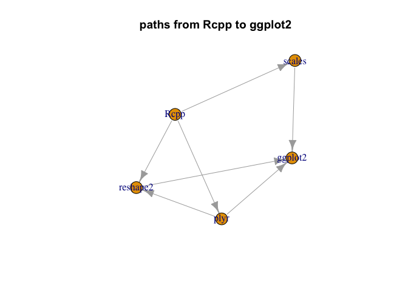
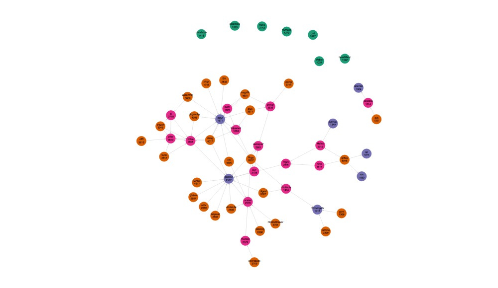

package reach
================

``` r
target_pkg <- "Rcpp"
```

Look at the reach of Rcpp.

``` r
library("rqdatatable")
```

    ## Loading required package: rquery

``` r
# # load package facts
# cran <- tools::CRAN_package_db()
# cr <- tools::CRAN_check_results()
# saveRDS(list(cran = cran, cr = cr), "cran_facts_2019_03_31.RDS")
lst <- readRDS("cran_facts_2019_03_31.RDS")
cran <- lst$cran
```

``` r
usage_types <- c("Depends", "Imports", "Suggests", "LinkingTo")
```

``` r
# convert comma separated list into
# sequence of non-core package names
parse_lists <- function(strs) {
  strs[is.na(strs)] <- ""
  strs <- gsub("[(][^)]*[)]", "", strs)
  strs <- gsub("\\s+", "", strs)
  strs <- strsplit(strs, ",", fixed=TRUE)
  strs <- lapply(
    strs,
    function(si) {
      setdiff(si, c("", "R", 
                    "base", "compiler", "datasets", 
                    "graphics", "grDevices", "grid",
                    "methods", "parallel", "splines", 
                    "stats", "stats4", "tcltk", "tools",
                    "translations", "utils"))
    })
  strs
}

# collect the columns we want
# collect the columns we want
d <- data.frame(
  Package = cran$Package,
  stringsAsFactors = FALSE)
for(use_type in c("Depends", "Imports", "Suggests", "LinkingTo")) {
  d[[use_type]] <- parse_lists(cran[[use_type]])
  d[[paste0("n_", use_type)]] <- vapply(d[[use_type]], length, numeric(1))
  use_str <- paste(use_type, target_pkg, sep = "_")
  d[[use_str]] <- vapply(d[[use_type]], 
                            function(di) {
                              target_pkg %in% di
                            }, logical(1))
  print(use_str)
  print(table(d[[use_str]]))
}
```

    ## [1] "Depends_Rcpp"
    ## 
    ## FALSE  TRUE 
    ## 13831   171 
    ## [1] "Imports_Rcpp"
    ## 
    ## FALSE  TRUE 
    ## 12625  1377 
    ## [1] "Suggests_Rcpp"
    ## 
    ## FALSE  TRUE 
    ## 13979    23 
    ## [1] "LinkingTo_Rcpp"
    ## 
    ## FALSE  TRUE 
    ## 12419  1583

``` r
# build relation graph edges
want <- logical(nrow(d))
for(relation in c("LinkingTo", "Depends", "Imports")) {
  want <- want | d[[paste(relation, target_pkg, sep = "_")]]
}
summary(want)
```

    ##    Mode   FALSE    TRUE 
    ## logical   12397    1605

``` r
edges <- data.frame(
  Uses = target_pkg,
  Package = d$Package[want],
  stringsAsFactors = FALSE)
nrow(edges)
```

    ## [1] 1605

``` r
# ick row-wise
get_edges <- function(row) {
  deps <- character(0)
  if(row$Package[[1]]!=target_pkg) {
    deps <- sort(base::unique(c(row$Depends[[1]], row$Imports[[1]], row$LinkingTo[[1]])))
  }
  if(length(deps)<1) {
    return(data.frame(
      Uses = character(0),
      Package = character(0),
      stringsAsFactors = FALSE))
  }
  data.frame(
      Uses = deps,
      Package = row$Package[[1]],
      stringsAsFactors = FALSE)
}
ee <- lapply(seq_len(nrow(d)),
             function(i) {
               get_edges(d[i, , drop = FALSE])
             })
ee <- do.call(rbind, ee)
ee <- ee[(ee$Uses!=target_pkg) & (ee$Package!=target_pkg), , drop = FALSE]
ee <- rbind(edges, ee)
```

``` r
# analyze the graph
graph <- igraph::graph_from_edgelist(as.matrix(ee), directed = TRUE)
f <- function(order) {
  length(igraph::ego(graph, mode="out", nodes = target_pkg, order = order)[[1]])
}


find_induced_subgraph <- function(start, end) {
  dist <- as.numeric(igraph::distances(graph, v = start, to = end , mode = "out"))
  if(is.infinite(dist)) {
    return(NULL)
  }
  nbhd <- igraph::ego(graph, mode="out", nodes = start, order = dist)[[1]]
  dback <- igraph::distances(graph, v = end, to = nbhd , mode = "in")
  nodes <- dback[ , !is.infinite(dback[1, , drop = TRUE]), drop = TRUE]
  subg <- igraph::induced_subgraph(graph, nbhd[names(nodes)], impl = "create_from_scratch")
  subg
}


# look at size distribution as a function of links from package

(sizes <- vapply(0:10, f, numeric(1)))
```

    ##  [1]    1 1606 4899 6152 6314 6336 6337 6337 6337 6337 6337

``` r
(sizes <- sizes - c(0, sizes[-length(sizes)]))
```

    ##  [1]    1 1605 3293 1253  162   22    1    0    0    0    0

``` r
(sum(sizes)-1)/nrow(d)
```

    ## [1] 0.4525068

``` r
last <- min(which(sizes==0))-2
(pkg <- setdiff(names(igraph::ego(graph, mode="out", nodes = target_pkg, order = last)[[1]]), 
                names(igraph::ego(graph, mode="out", nodes = target_pkg, order = last-1)[[1]])))
```

    ## [1] "kwb.hantush"

``` r
pkg <- pkg[[1]]

plot(find_induced_subgraph(target_pkg, pkg))
title(paste("paths from", target_pkg, "to", pkg))
```



``` r
# Look at some examples


plot(find_induced_subgraph(target_pkg, "ggplot2"))
title(paste("paths from", target_pkg, "to", "ggplot2"))
```


``` r
plot(find_induced_subgraph(target_pkg, "tidyr"))
title(paste("paths from", target_pkg, "to", "tidyr"))
```


